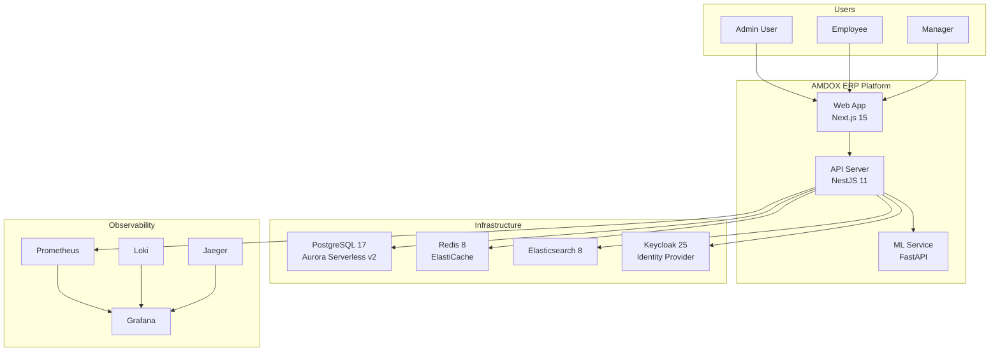
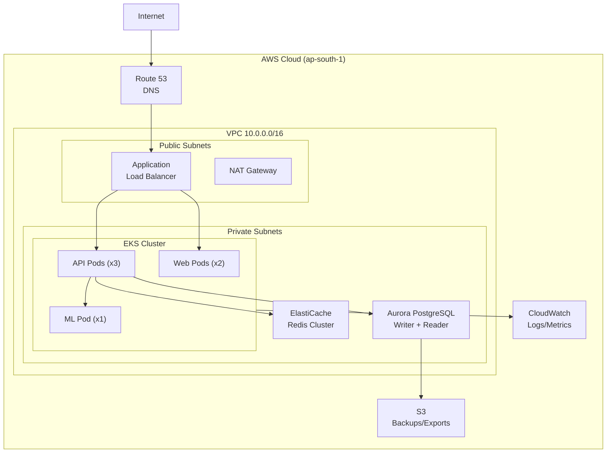
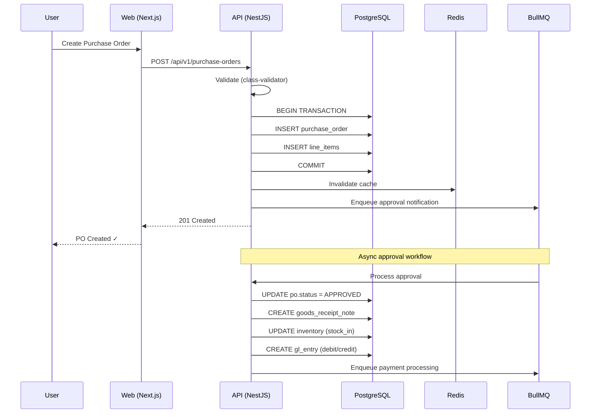
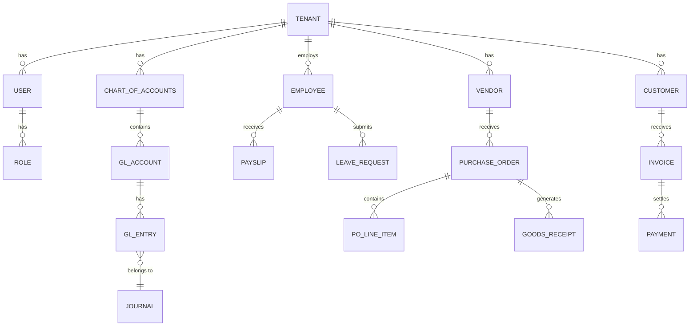

# AMDOX ERP — System Architecture

## C4 Model — System Context



## Technology Stack

| Category | Technology | Version | Rationale |
|----------|-----------|---------|-----------|
| **Frontend** | Next.js + React | 15 / 19 | SSR, App Router, streaming |
| **Backend** | NestJS + TypeScript | 11 / 5.7 | Enterprise DI, decorators, modules |
| **ML/AI** | FastAPI + scikit-learn | 0.115 / 1.6 | Async, high performance, ML ecosystem |
| **Database** | PostgreSQL (Aurora) | 17 | ACID, JSON, partitioning, Serverless v2 |
| **ORM** | Prisma | 5.10 | Type-safe, migrations, schema-first |
| **Cache** | Redis | 8 | Sub-ms latency, BullMQ job queues |
| **Search** | Elasticsearch | 8.17 | Full-text search, analytics, aggregations |
| **Auth** | Keycloak | 25 | OIDC/SAML, RBAC, multi-tenant realms |
| **Container** | Docker + distroless | 22 | Minimal attack surface, no shell |
| **Orchestration** | Kubernetes + Helm | 1.29 | Auto-scaling, self-healing, declarative |
| **IaC** | Terraform | 1.7+ | Multi-cloud, state management, modules |
| **CI/CD** | GitHub Actions + ArgoCD | - | GitOps, canary deploys, auto-rollback |
| **Observability** | OTEL + Prometheus + Grafana | - | Metrics, traces, logs, dashboards |

## Deployment Topology



## Data Flow — Purchase Order to Payment



## API Patterns

### REST Conventions
- **Base URL:** `/api/v1/`
- **Naming:** Plural nouns (`/invoices`, `/employees`)
- **Methods:** GET (list/read), POST (create), PATCH (update), DELETE (soft-delete)
- **Filtering:** `?status=ACTIVE&from=2024-01-01`
- **Pagination:** Cursor-based (`?cursor=abc&limit=20`)
- **Sorting:** `?sort=createdAt:desc`

### Error Response Schema
```json
{
  "statusCode": 422,
  "error": "Unprocessable Entity",
  "message": "Validation failed",
  "details": [
    { "field": "amount", "message": "Must be positive" }
  ],
  "timestamp": "2024-01-15T10:30:00Z",
  "path": "/api/v1/invoices",
  "traceId": "abc123"
}
```

## Database Schema (Core Entities)


